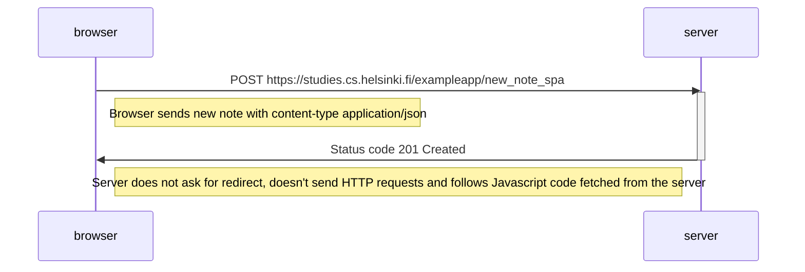

```mermaid
sequenceDiagram
    participant browser
    participant server

    browser->>server: POST https://studies.cs.helsinki.fi/exampleapp/new_note_spa
    activate server

    Note right of browser: Browser sends new note with content-type application/json

    server->>browser: Status code 201 Created
    deactivate server

    Note left of server: Server does not ask for redirect, doesn't send HTTP requests and follows Javascript code fetched from the server

```